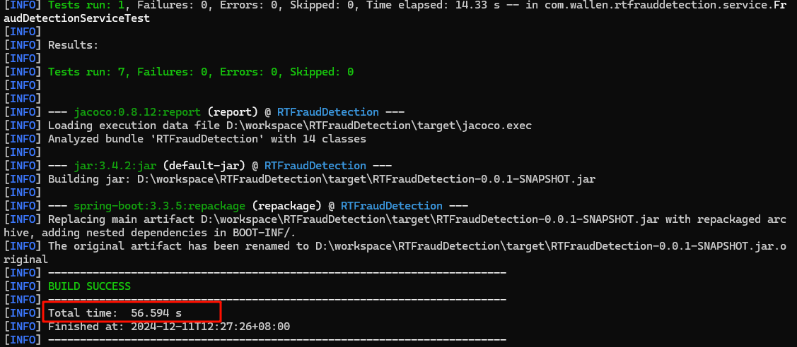
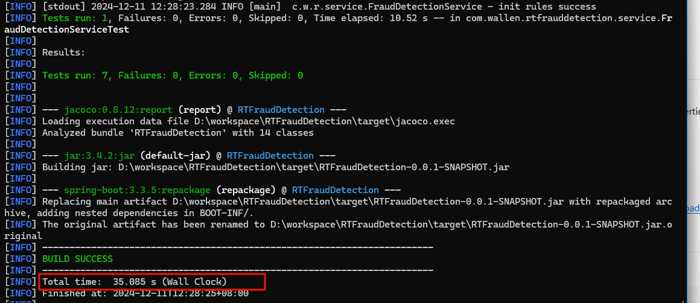

+++  
date = '2022-02-10T16:52:09+08:00'
title = 'mvnd-更快的maven'  
categories  = ['ServerTech']   
tags = ['构建']  
+++

## 1. 安装mvnd  
下载地址 [https://github.com/apache/maven-mvnd/releases/download/0.7.1/mvnd-0.7.1-windows-amd64.zip](https://github.com/apache/maven-mvnd/releases/download/0.7.1/mvnd-0.7.1-windows-amd64.zip)  
**前置条件：** 0.7.1 版本需要 java 11，系统需要有 JAVA_HOME 环境变量 或者在解压目录 conf 目录中的 mvnd.properties  149行配置 java.home；

解压至任意目录，将 bin 目录添加到环境变量，即可到处使用了；

win10 注意可能会出现缺少动态链接库的问题，验证方法，进入到bin目录点击 mvnd.exe看是否报错

> 提示： 找不到VCRUNTIME140\_1.dll，无法继续执行代码。重新安装程序可能会解决此问题

请安装 vc\_redist.x64.exe  [https://support.microsoft.com/en-us/help/2977003/the-latest-supported-visual-c-downloads](https://support.microsoft.com/en-us/help/2977003/the-latest-supported-visual-c-downloads)

## 2. mvn 和 mvnd 性能小测试   
相同的构建环境执行了两遍验证，构建过程下载的依赖资源已经在本地了，没有下载过程，纯本地编译构建。

```bash
 mvn.cmd  clean package -s .\settings.xml -DskipTests=true
```


```bash
mvnd.cmd clean package   -s .\settings.xml -DskipTests=true
```



## 结论
maven 的自我革新带来的效率提升还是很明显的，经常使用maven的小伙伴可以试试，大型构建项目可能效果更佳。

项目地址在这里 [https://github.com/apache/maven-mvnd](https://github.com/apache/maven-mvnd) 有兴趣了解的可以看看

